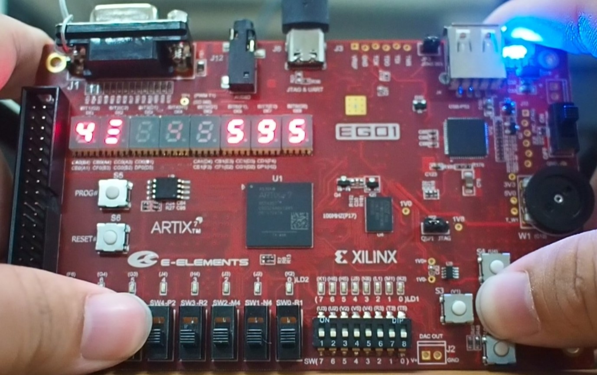
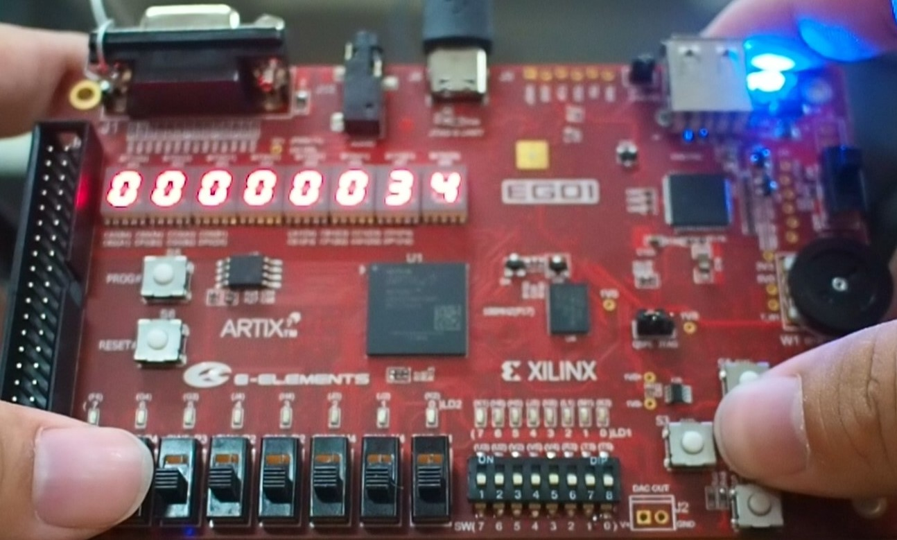

# Digit-Invader-EGO1

Digit Invader is the built-in game on Casio MG-880. This is a partial remake on EGO1 FPGA development board.

User Input: 4 bit by slide switch for the input number. 1 push-button for Fire. 1 push-button for display test.

Seven-segment display runs at 400Hz. Main control and button debounce runs at 2kHz. LFSR (Linear-feedback shift register) pseudo-random number generator runs at 100MHz, and takes user input as random source.  

## Hardware

Development Board: EDK-A7-EGO1 from E-Elements

## Images

  
Game

  
Score display

## Known bugs

* Numbers in sequence may change or disappear
